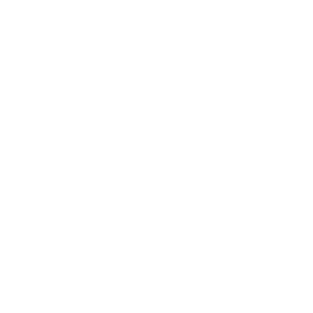

Certainly! Let's break down the entire code step-by-step to understand how it works.

### Code Overview

This JavaScript code is designed to fetch a list of songs from a server, display them in a playlist on a webpage, and provide functionality to play and pause those songs.

### Detailed Explanation

#### 1. **Creating an Audio Object**

```javascript
let currentsong = new Audio();
```

- **`let currentsong = new Audio();`**: This line creates a new `Audio` object named `currentsong`. This object is used to control audio playback, such as playing, pausing, and setting the source of the audio.

#### 2. **Fetching the List of Songs**

```javascript
async function getsongs() {
    try {
        let response = await fetch("http://127.0.0.1:3000/songs/");
        let text = await response.text();
        let divv = document.createElement("div");
        divv.innerHTML = text;
        let a = divv.getElementsByTagName("a");

        let songs = [];
        for (let element of a) {
            if (element.href.endsWith(".mp3")) {
                songs.push(element.href.split("/songs/")[1]);
            }
        }
        return songs;
    } catch (error) {
        console.error("Error fetching songs:", error);
        return [];
    }
}
```

- **`async function getsongs()`**: This is an asynchronous function that fetches the list of songs from a server.
- **`fetch("http://127.0.0.1:3000/songs/")`**: Sends a GET request to the specified URL to get the list of songs.
- **`await response.text()`**: Waits for the response to be fully received and converts it to text.
- **`divv.innerHTML = text`**: Creates a temporary `div` element and sets its inner HTML to the fetched text. This is used to parse the list of songs.
- **`divv.getElementsByTagName("a")`**: Extracts all anchor (`<a>`) tags from the `div`. Each anchor tag typically represents a song link.
- **`if (element.href.endsWith(".mp3"))`**: Filters out the links that end with `.mp3`, which indicates they are music files.
- **`songs.push(element.href.split("/songs/")[1])`**: Extracts the song name from the URL and adds it to the `songs` array.
- **`catch (error)`**: Handles any errors that occur during the fetch process.

#### 3. **Playing a Song**

```javascript
const playmusic = (track) => {
    const songUrl = `http://127.0.0.1:3000/songs/${track}`;
    currentsong.src = songUrl;
    currentsong.play();
    document.getElementById("play").src = "icons/pause.svg"; // Update play button icon
};
```

- **`const playmusic = (track)`**: Defines a function that plays a song given its track name.
- **`const songUrl = \`http://127.0.0.1:3000/songs/${track}\``**: Constructs the full URL to the song file.
- **`currentsong.src = songUrl`**: Sets the `src` property of the `currentsong` audio object to the song URL.
- **`currentsong.play()`**: Starts playing the song.
- **`document.getElementById("play").src = "icons/pause.svg"`**: Changes the play button's icon to indicate that the song is playing.

#### 4. **Main Function**

```javascript
async function main() {
    let songs = await getsongs();
    let songUL = document.querySelector(".songlist ul");
    songUL.innerHTML = ''; // Clear existing list

    for (const song of songs) {
        songUL.innerHTML += `
            <li>
                
                <div class="info">
                    <div>${song.replaceAll("%20", " ")}</div>
                    <div>AYUSH BHAI</div>
                </div>
                <div class="left-side-playbtn">
                    PlayNow
                    <svg version="1.1" xmlns="http://www.w3.org/2000/svg" viewBox="0 0 512 512">
                        <circle cx="256" cy="256" r="256" fill="#09d747"></circle>
                        <path d="M351.062,258.898l-144,85.945c-1.031,0.626-2.344,0.657-3.406,0.031c-1.031-0.594-1.687-1.702-1.687-2.937v-85.946v-85.946c0-1.218,0.656-2.343,1.687-2.938c1.062-0.609,2.375-0.578,3.406,0.031l144,85.962c1.031,0.586,1.641,1.718,1.641,2.89C352.703,257.187,352.094,258.297,351.062,258.898z" fill="#000000"></path>
                    </svg>
                </div>  
            </li>`;
    }

    document.querySelectorAll(".songlist li").forEach(li => {
        li.addEventListener("click", () => {
            let songName = li.querySelector(".info div").textContent.trim();
            playmusic(songName);
        });
    });

    document.getElementById("play").addEventListener("click", () => {
        if (currentsong.paused) {
            currentsong.play();
            document.getElementById("play").src = "icons/pause.svg";
        } else {
            currentsong.pause();
            document.getElementById("play").src = "icons/play.svg";
        }
    });
}

main();
```

- **`async function main()`**: This is the main function that initializes the playlist and sets up event listeners.
- **`let songs = await getsongs()`**: Calls the `getsongs` function to fetch the list of songs.
- **`let songUL = document.querySelector(".songlist ul")`**: Selects the `<ul>` element inside the element with the class `.songlist`.
- **`songUL.innerHTML = ''`**: Clears any existing songs in the list.
- **`for (const song of songs)`**: Loops through each song in the `songs` array.
- **`songUL.innerHTML += ...`**: Adds each song to the playlist as a new list item (`<li>`) with a play button.
- **`document.querySelectorAll(".songlist li").forEach(li => {...})`**: Adds a click event listener to each list item. When clicked, it retrieves the song name and calls `playmusic` to play that song.
- **`document.getElementById("play").addEventListener("click", () => {...})`**: Adds a click event listener to the play/pause button. It toggles between playing and pausing the current song, and updates the button icon accordingly.

### Summary

- **Fetching Songs**: Retrieves a list of songs from a server.
- **Playing Songs**: Allows users to play a selected song by setting the audio source and calling `play`.
- **Displaying Songs**: Renders the song list dynamically in the UI.
- **Play/Pause Functionality**: Toggles between play and pause for the current song, with visual feedback through button icons.

If you have any specific questions or need more details about any part, let me know!